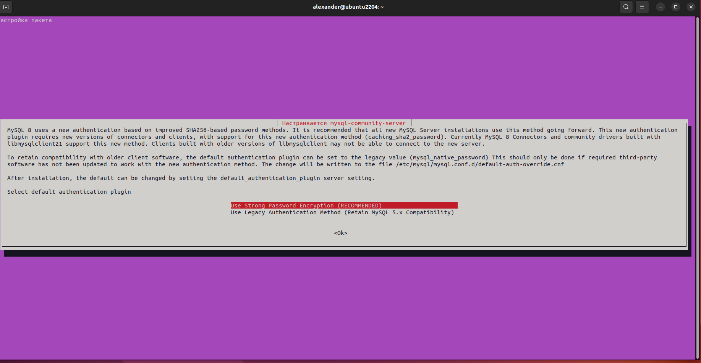

# FinalControlWorkOnSpecializationBlock

## Работа с Linux
### Задание 1:
    Создать два текстовых файла: "Pets"(Домашние животные) и "Pack animals"(вьючные животные), используя команду `cat` в терминале Linux. В первом файле перечислить собак, кошек и хомяков. Во втором — лошадей, верблюдов и ослов.
   - Объединить содержимое этих двух файлов в один и просмотреть его содержимое.
   - Переименовать получившийся файл в "Human Friends".

    Пример конечного вывода после команды “ls” :
    Desktop Documents Downloads  HumanFriends.txt  Music  PackAnimals.txt  Pets.txt  Pictures  Videos

***Решение:***
---
mkdir final_control_work_specialization \
cat > pets \
1 Fido Dog 2020--01-01 Sit,Stay,Fetch \
2 Whisker Cat 2019-05-15 Sit,Pounce \
3 Hammy Hamster 2021-03-10 Roll,Hide \
4 Buddy Dog 2018-12-10 Sit,Paw,Bark \
5 Smudge Cat 2020-02-20 Sit,Pounce,Scratch \
6 Peanut Hamster 2021-08-01 Roll,Spin \
7 Bella Dog 2019-11-11 Sit,Stay,Roll \
8 Oliver Cat 2020-06-30 Meow,Scratch,Jump \

cat > pack_animals

1 Thunder Horse 2015-07-21 Trot,Canter,Gallop \
2 Sandy Camel 2016-11-03 Walk,Carry,Load \
3 Eyeore Donkey 2017-09-18 Walk,Carry,Load,Bray \
4 Storm Horse 2014-05-05 Trot,Canter \
5 Dune Camel 2018-12-12 Walk,Sit \
6 Burro Donkey 2019-01-23 Walk,Bray,Kick \
7 Blaze Horse 2016-02-29 Trot,Jump,Gallop \
8 Sahara Camel 2015-08-14 Walk,Run \

cat pets pack_animals > pets_and_pack_animals\
cat pets_and_pack_animals

Рис.1: результаты объединения в командной строке

mv pets_and_pack_animals human_friends \
ls

Рис.2: результаты переименования в командной строке

### Задание 2:
    Создать директорию, переместить файл туда.

***Решение***
---
mkdir new_directory \
mv human_friends new_directory

Рис.3: результаты перемещения в командной строке

### Задание 3:
    Работа с MySQL в Linux. “Установить MySQL на вашу вычислительную машину”.

***Решение***
---

sudo apt update \
sudo apt install mysql-server –y

Рис.4: установка mysql

	- Подключить дополнительный репозиторий MySQL и установить один из пакетов из этого репозитория.

***Решение***
---

скачиваем файл deb пакет с конфигурацией репозитория из официального сайта, https://dev.mysql.com/downloads/repo/apt/

Рис.5: дополнительный репозиторий MySQL

sudo apt install mysql-server mysql-client 

Рис.6: установка из дополнительного репозитория

### Задание 4:
    Управление deb-пакетами. Установить и затем удалить deb-пакет, используя команду `dpkg`.

***Решение***
---

")
")

Рис.7: управление deb-пакетами (установка и удаление)

### Задание 5:
    Выложить историю команд в терминале ubuntu.

***Решение***
---
Все команды выложены в задании 3, 4, 5...

### Задание 6:
    Нарисовать диаграмму, в которой есть класс родительский класс, домашние животные и вьючные животные, в составы которых в случае домашних животных войдут классы: собаки, кошки, хомяки, а в класс вьючные животные войдут: Лошади, верблюды и ослы.

***Решение***
---

Рис.8: диаграмма классов

### Задание 7:
    В подключенном MySQL репозитории создать базу данных “Друзья человека”.

***Решение***
---
sudo mysql \
show databases; \
create database humanfriends; 

Рис.9: результаты создания базы данных в командной строке

### Задание 8:
    Создать таблицы с иерархией из диаграммы в БД.

***Решение***
---

use humanfriends;

CREATE TABLE dogs (id_dog INT AUTO_INCREMENT NOT NULL PRIMARY KEY, nickname VARCHAR(50) NOT NULL, birthday DATE NOT NULL, commands TEXT);

CREATE TABLE cats (id_cat INT AUTO_INCREMENT NOT NULL PRIMARY KEY, nickname VARCHAR(50) NOT NULL, birthday DATE NOT NULL, commands TEXT);

CREATE TABLE hamsters (id_hamster INT AUTO_INCREMENT NOT NULL PRIMARY KEY, nickname VARCHAR(50) NOT NULL, birthday DATE NOT NULL, commands TEXT);

CREATE TABLE horses (id_horse INT AUTO_INCREMENT NOT NULL PRIMARY KEY, nickname VARCHAR(50) NOT NULL, birthday DATE NOT NULL, commands TEXT);

CREATE TABLE camels (id_camel INT AUTO_INCREMENT NOT NULL PRIMARY KEY, nickname VARCHAR(50) NOT NULL, birthday DATE NOT NULL, commands TEXT);

CREATE TABLE donkeys (id_donkey INT AUTO_INCREMENT NOT NULL PRIMARY KEY, nickname VARCHAR(50) NOT NULL, birthday DATE NOT NULL, commands TEXT);

### Задание 9:
    Заполнить низкоуровневые таблицы именами(животных), командами которые они выполняют и датами рождения.

***Решение:***
---

INSERT INTO dogs (nickname, birthday, commands) VALUES ('Fido', '2020-01-01', 'Sit,Stay,Fetch'); \
INSERT INTO dogs (nickname, birthday, commands) VALUES ('Buddy','2018-12-10','Sit,Paw,Bark'); \
INSERT INTO dogs (nickname, birthday, commands) VALUES ('Bella','2019-11-11','Sit,Stay,Roll');

Рис.10: результаты заполнения таблицы dogs в командной строке

INSERT INTO cats (nickname, birthday, commands) VALUES ('Whisker','2019-05-15','Sit,Pounce'); \
INSERT INTO cats (nickname, birthday, commands) VALUES ('Smudge','2020-02-20','Sit,Pounce,Scratch'); \
INSERT INTO cats (nickname, birthday, commands) VALUES ('Oliver','2020-06-30','Meow,Scratch,Jump');

Рис.11: результаты заполнения таблицы cats в командной строке

INSERT INTO hamsters (nickname, birthday, commands) VALUES ('Hammy','2021-03-10','Roll,Hide'); \
INSERT INTO hamsters (nickname, birthday, commands) VALUES ('Peanut','2021-08-01','Roll,Spin');

Рис.12: результаты заполнения таблицы hamsters в командной строке

INSERT INTO horses (nickname, birthday, commands) VALUES ('Thunder','2015-07-21','Trot,Canter,Gallop'), ('Storm','2014-05-05','Trot,Canter'), ('Blaze','2016-02-29','Trot,Jump,Gallop');

Рис.13: результаты заполнения таблицы horses в командной строке

INSERT INTO camels (nickname, birthday, commands) VALUES ('Sandy','2016-11-03','Walk,Carry,Load'), ('Dune','2018-12-12','Walk,Sit'), ('Sahara','2015-08-14','Walk,Run');

Рис.14: результаты заполнения таблицы camels в командной строке

INSERT INTO donkeys (nickname, birthday, commands) VALUES ('Eyeore','2017-09-18','Walk,Carry,Load,Bray'), ('Burro','2019-01-23','Walk,Bray,Kick');

Рис.15: результаты заполнения таблицы donkeys в командной строке

### Задание 10:
    Удалив из таблицы верблюдов, т.к. верблюдов решили перевезти в другой питомник на зимовку. Объединить таблицы лошади, и ослы в одну таблицу.

***Решение:***
---

DELETE FROM camels;

Рис.16: результаты очистки таблицы camels в командной строке

CREATE TABLE horses_donkeys \
( SELECT id_horse AS id, nickname, birthday, commands \
FROM horses \
UNION ALL \
SELECT id_donkey, nickname, birthday, commands \
FROM donkeys );

Рис.17: результаты слияния таблиц horses и donkeys в командной строке

### Задание 11:
    Создать новую таблицу “молодые животные” в которую попадут все животные старше 1 года, но младше 3 лет и в отдельном столбце с точностью до месяца подсчитать возраст животных в новой таблице.

***Решение:***
---

ЧТОБЫ ВЫБОРКА ВЫГЛЯДЕЛА ИНТЕРЕСНЕЙ (больше данных) СДЕЛАЛ от 2 до 5 лет.

CREATE TABLE all_animals_between_2_and_5_old \
( \
SELECT id_hamster AS id, nickname, birthday, commands, \
CONCAT(PERIOD_DIFF(DATE_FORMAT(CURDATE(),'%y%m'), DATE_FORMAT(birthday,'%y%m')) div 12, " лет, ", \
PERIOD_DIFF(DATE_FORMAT(CURDATE(),'%y%m'), DATE_FORMAT(birthday,'%y%m')) mod 12, " мес.") AS fullage \
FROM hamsters \
WHERE PERIOD_DIFF(DATE_FORMAT(CURDATE(),'%y%m'), DATE_FORMAT(birthday,'%y%m')) / 12 between 2 AND 5 \
UNION ALL \
SELECT id_cat, nickname, birthday, commands, \
CONCAT(PERIOD_DIFF(DATE_FORMAT(CURDATE(),'%y%m'), DATE_FORMAT(birthday,'%y%m')) div 12, " лет, ", \
PERIOD_DIFF(DATE_FORMAT(CURDATE(),'%y%m'), DATE_FORMAT(birthday,'%y%m')) mod 12, " мес.") AS fullage \
FROM cats \
WHERE PERIOD_DIFF(DATE_FORMAT(CURDATE(),'%y%m'), DATE_FORMAT(birthday,'%y%m')) / 12 between 2 AND 5 \
UNION ALL \
SELECT id_dog, nickname, birthday, commands, \
CONCAT(PERIOD_DIFF(DATE_FORMAT(CURDATE(),'%y%m'), DATE_FORMAT(birthday,'%y%m')) div 12, " лет, ", \
PERIOD_DIFF(DATE_FORMAT(CURDATE(),'%y%m'), DATE_FORMAT(birthday,'%y%m')) mod 12, " мес.") AS fullage \
FROM dogs \
WHERE PERIOD_DIFF(DATE_FORMAT(CURDATE(),'%y%m'), DATE_FORMAT(birthday,'%y%m')) / 12 between 2 AND 5 \
UNION ALL \
SELECT id_horse, nickname, birthday, commands, \
CONCAT(PERIOD_DIFF(DATE_FORMAT(CURDATE(),'%y%m'), DATE_FORMAT(birthday,'%y%m')) div 12, " лет, ", \
PERIOD_DIFF(DATE_FORMAT(CURDATE(),'%y%m'), DATE_FORMAT(birthday,'%y%m')) mod 12, " мес.") AS fullage \
FROM horses \
WHERE PERIOD_DIFF(DATE_FORMAT(CURDATE(),'%y%m'), DATE_FORMAT(birthday,'%y%m')) / 12 between 2 AND 5 \
UNION ALL \
SELECT id_camel, nickname, birthday, commands, \
CONCAT(PERIOD_DIFF(DATE_FORMAT(CURDATE(),'%y%m'), DATE_FORMAT(birthday,'%y%m')) div 12, " лет, ", \
PERIOD_DIFF(DATE_FORMAT(CURDATE(),'%y%m'), DATE_FORMAT(birthday,'%y%m')) mod 12, " мес.") AS fullage \
FROM camels \
WHERE PERIOD_DIFF(DATE_FORMAT(CURDATE(),'%y%m'), DATE_FORMAT(birthday,'%y%m')) / 12 between 2 AND 5 \
UNION ALL \
SELECT id_donkey, nickname, birthday, commands, \
CONCAT(PERIOD_DIFF(DATE_FORMAT(CURDATE(),'%y%m'), DATE_FORMAT(birthday,'%y%m')) div 12, " лет, ", \
PERIOD_DIFF(DATE_FORMAT(CURDATE(),'%y%m'), DATE_FORMAT(birthday,'%y%m')) mod 12, " мес.") AS fullage \
FROM donkeys \
WHERE PERIOD_DIFF(DATE_FORMAT(CURDATE(),'%y%m'), DATE_FORMAT(birthday,'%y%m')) / 12 between 2 AND 5 \
);

Рис.18: создание таблицы “молодые животные” запросом в консоли

Рис.19: результат создания таблицы “молодые животные” запросом в консоли

### Задание 12:
    Объединить все таблицы в одну, при этом сохраняя поля, указывающие на прошлую принадлежность к старым таблицам.

***Решение***
---

CREATE TABLE allanimals ( \
	SELECT * FROM ( \
	SELECT id_dog AS id, nickname, "Dog", birthday, commands \
	FROM dogs \
	UNION ALL \
	SELECT id_cat, nickname, "Cat", birthday, commands \
	FROM cats \
	UNION ALL \
	SELECT id_hamster, nickname, "Hamster", birthday, commands \
	FROM hamsters \
	UNION ALL \
	SELECT id_horse, nickname, "Horse", birthday, commands \
	FROM horses \
	UNION ALL \
	SELECT id_camel, nickname, "Camel", birthday, commands \
	FROM camels \
	UNION ALL \
	SELECT id_donkey, nickname, "Donkey", birthday, commands \
	FROM donkeys \
	) as innerquery \
);

Рис.20: создание таблицы “все животные” запросом в консоли

Рис.21: результат создания таблицы “все животные” запросом в консоли

### Задание 13.
	Создать класс с Инкапсуляцией методов и наследованием по диаграмме.

***Решение***
---
	Созданы классы модели Animal от которого наследованы классы потомки PackAnimal и Pet от которых классы потомки Dog, Cat, Hamster и Horse, Camel, Donkey. Также создан класс Command. Класс Animals, явлется контейнером для хранения списка животных ("реестра животных") типа Animal. Для хранения списка команд типа Command используется класс Commands.

### Задание 14.
	Написать программу, имитирующую работу реестра домашних животных. В программе должен быть реализован следующий функционал:

***Решение***
---
	Программу написана с использованием паттерна проектирования MVC.

#### 14.1 Завести новое животное.

***Решение***
---
	Команда "завести новое животное" реализована как метод addAnimal класса Animals.

#### 14.2 Определять животное в правильный класс.

***Решение***
---
	Животное определяется в правильный класс при создании c использованием класса контроллера AnimalController.

#### 14.3 Увидеть список команд, которое выполняет животное.

***Решение***
---
	Команда "список команд животного" отображается при вызове метода showCommands объекта "вьювера" типа AnimalView с использованием метода allCommandsToString экземпляра класса Animal.

#### 14.4 Обучить животное новым командам.

***Решение***
---
	Команда "изучить новую команду животным" использует метод learnCommand экземпляра объекта типа Animal.

#### 14.5 Реализовать навигацию по меню.

***Решение***
---
	Навигации реализована с помощью метода start контроллера типа AnimalController во взаимодействии с классом AnimalView.

### Задание 15.
	Создайте класс Счетчик, у которого есть метод add(), увеличивающий̆ значение внутренней̆ int переменной̆на 1 при нажатие “Завести новое животное” Сделайте так, чтобы с объектом такого типа можно было работать в блоке try-with-resources. Нужно бросить исключение, если работа с объектом типа счетчик была не в ресурсном try и/или ресурс остался открыт. Значение считать в ресурсе try, если при заведения животного заполнены все поля.

***Решение***
---
	Класс Счетчик типа Counter используется в блоке try в команде создания нового животного метода start контроллера AnimalController.